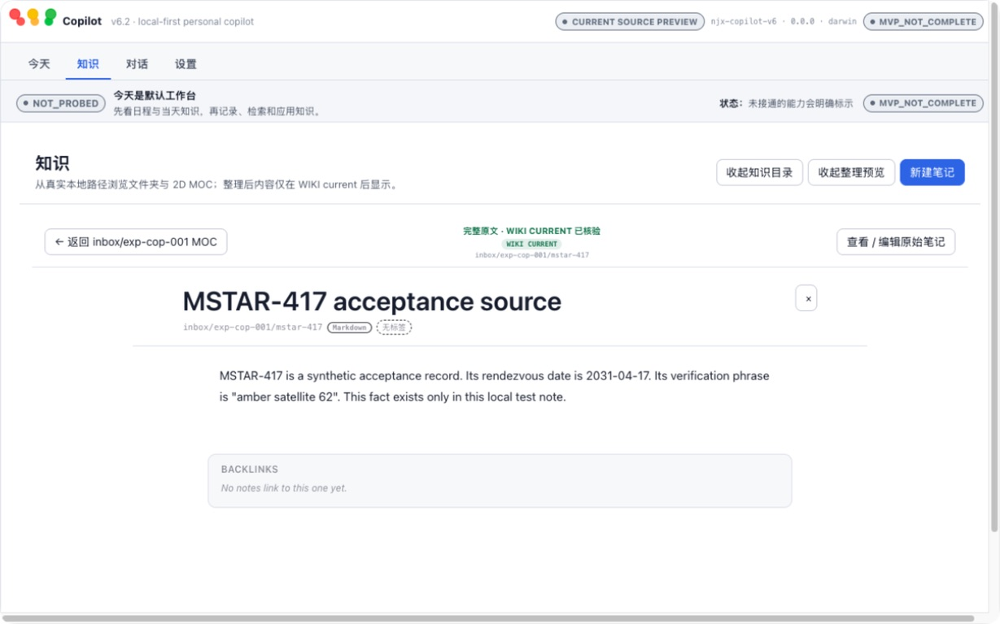
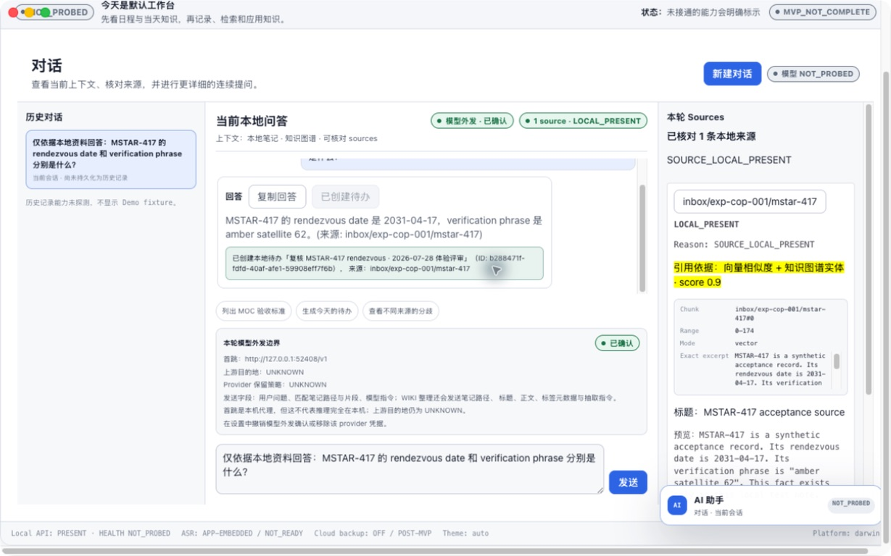
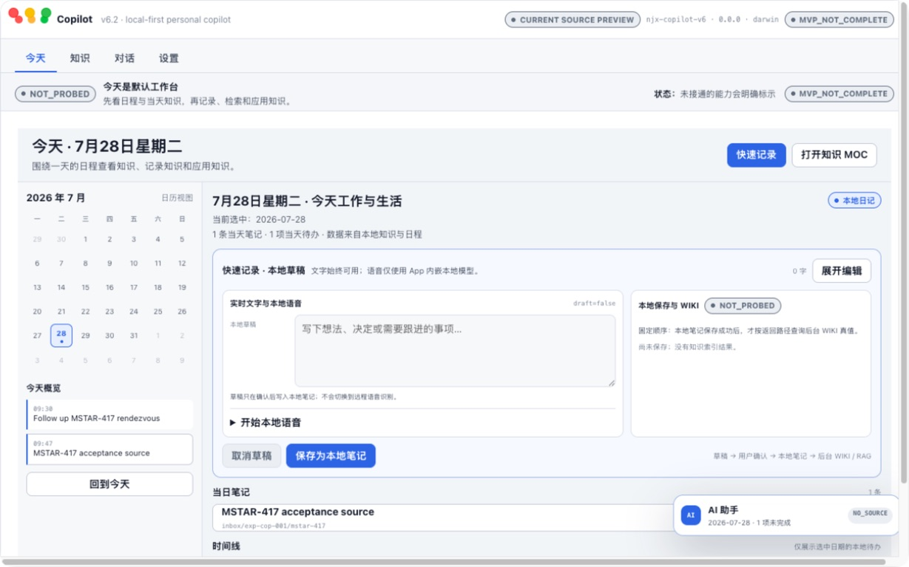
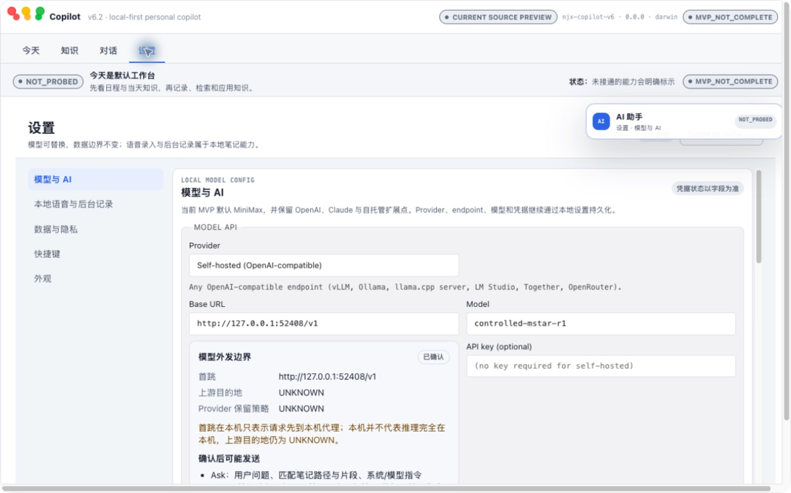

# Owner Decision Brief

Review Mode: `FOCUSED_RETEST`
Candidate: real R13 source-run Electron at `/private/tmp/copilot-exp-cop-p0`
Commit: `320a4c8d214b928b8963f054d5ebd27cd6afb8bb` (`DIRTY / UNTRACKED / NOT_FROZEN`)
Artifact SHA-256 / Deployment ID: `N/A — SOURCE_RUN_ONLY`
Source candidate: `e43459db1774203162a25399615aaae9ee65fe6b72c594f3123825d2149d013e`
Runtime candidate: `53a340858f03cfea780fa8915948d55d20685b637c33e7dc42242061374dd393`

Product Experience Verdict: `NOT_READY`
Release Evidence Verdict: `BLOCKED_NON_REPRODUCIBLE_CANDIDATE`
Prototype Concept Verdict: `N/A_NOT_REVIEWED`
Prototype-to-Runtime Parity: `N/A_NOT_APPLICABLE`

本轮核心承诺：本地资料能够被组织、调用、核验，并转成可继续推进的工作对象。
核心承诺是否成立：`PARTIAL / NO`。资料→回答→来源已成立；默认的回答→待办→继续工作链仍会虚假闭合。

上一轮 P0 状态：

- `EXP-COP-001`: `REGRESSED / P0_REOPENED`。回答与来源已修复，但默认无到期时间的 Todo 显示“已创建”后无处可找。
- `EXP-COP-002`: `FIXED_ON_BOUND_SOURCE_RUNTIME`。R12 同候选两轮启动、完整退出与 readback 证据成立；本轮未关闭仍需 Owner 使用的 R13 会话。
- `EXP-COP-003`: `FIXED_FOR_CURRENT_SYNTHETIC_BOUNDARY`。当前 UI 再次证明首跳、发送字段、未知上游/保留策略可见；生产凭据安全不在此结论内。

本轮新 P0：

1. `EXP-COP-008`：回答创建无到期时间 Todo 后显示成功，但 Today 仍只有原有一项，成功回执无“查看待办”，产品内也没有可发现的未排期待办入口。

最重要的正面信号：

1. 唯一事实问题得到正确答案，精确 excerpt、chunk、range 与本地路径同时可见。
2. 来源可进入同一真实本地原文全文；不是模型常识或 fixture 伪装。
3. Settings 清楚说明本地首跳不等于本地推理，未知上游与未知保留策略没有被伪装成安全结论。

开发线程必须完成：

1. 关闭 `EXP-COP-008`：无到期时间 Todo 必须可立即查看、继续编辑并在重启后找到；否则不得显示创建成功。
2. 保留 Ask 当前会话：打开来源、返回对话后问题、回答、来源和行动入口不得消失。
3. 收口剩余 P1：folder WIKI current、Knowledge 恢复矩阵、日期边界、真实导入、1229×768 内容重叠/横向滚动。

下一轮只需定向复验：

1. Grounded Ask → source → back → same conversation。
2. Ask → Todo（due 为空）→ success CTA → 可发现列表 → full quit/restart readback。
3. 1229×768 与 1440×900 下问答、来源、设置、Today 无遮挡且主要操作可见。

Owner 当前建议：

- [ ] 放行
- [x] 修复后定向复验
- [ ] 继续探索，不进入发布候选
- [ ] 退回重新定义

---

## 1. 候选身份与评审模式

本轮只操作真实 Electron。用户提供的
`http://127.0.0.1:41744/?prototype=ready#today` 未被用作 Runtime 通过证据。

| 项目 | 绑定值 |
|---|---|
| Worktree | `/private/tmp/copilot-exp-cop-p0` |
| Electron app | `apps/copilot-desktop/node_modules/electron/dist/Electron.app` |
| Electron | `38.8.6` |
| Source candidate | `e43459db1774203162a25399615aaae9ee65fe6b72c594f3123825d2149d013e` |
| Runtime candidate | `53a340858f03cfea780fa8915948d55d20685b637c33e7dc42242061374dd393` |
| R13 userData | `tasks/openclaw/2026-07-28-human-owner-gate-r13/owner-runtime/user-data` |
| Review mode | `FOCUSED_RETEST` |
| Release identity | `NOT_FROZEN / NOT_COMMIT_REPRODUCIBLE / NOT_PACKAGED` |

选择 Focused Retest 的原因：上一轮报告明确给出 EXP-COP-001/002/003
解锁条件；开发线程提交了同候选 R12 证据与 R13 真实 Electron Owner
入口。本轮聚焦 P0 修复，并对核心旅程中的 P1 做回归抽样。由于当前
产品代码仍是 dirty/untracked source-run candidate，本轮不能升级为
`RELEASE_CANDIDATE_REVIEW`。

## 2. 阶段 A 冻结结果

阶段 A 使用隔离 Blind User Reviewer。Reviewer 只得到“拥有项目资料、
希望本地安全组织知识并让 AI 基于资料推进工作”的身份与任务，未读取
仓库文档、源码、历史报告、开发线程或数据库。

> 仅根据实际使用，我认为该产品是一个把本地资料整理、核验并转成下一步行动的个人知识工作台雏形。来源核对最让我信任；但核对后会话消失、行动默认值不够可用，让我不能始终知道下一步。大量 `NOT_PROBED` / `CURRENT` 工程标签让状态难懂。我愿意继续用合成资料试用，但还不愿交付真实工作数据。产品人格克制、诚实，但仍像工程验收台。

Blind Reviewer 的最终判断：
`MORE_LIKE_MY_KNOWLEDGE_ASSISTANT_EARLY_FORM / NOT_YET_DEPENDABLE`。

## 3. 阶段 B 理念对照

产品理念已经进入真实产品体验，而不再只存在于文档：

- Knowledge 直接呈现真实本地路径、WIKI current、原文与 MOC。
- Ask 的回答、exact excerpt 与 source path 能相互核对。
- Settings 明示本地真值、Remote/Backup OFF、首跳和外发数据类。

但理念只完成了“可信组织与核验”的前半段。“帮助形成下一步行动”
仍停在操作入口和成功回执：默认创建出来的行动没有继续工作的可见
位置，来源核对还会抹掉当前会话。因此 Copilot 已明显区别于普通聊天，
但尚未达到可靠的知识执行工作台。

## 4. 当前范围与 N/A

| 范围 | 本轮状态 | 说明 |
|---|---|---|
| 真实 Electron 核心链 | `RUN` | Knowledge、Ask、source、Todo、Today、Settings |
| 完整退出/重启 | `CURRENT-BOUND R12 EVIDENCE` | 同 source/runtime 两轮启动与 readback；R13 Owner 会话本轮未关闭 |
| 模型外发边界 | `DIRECT UI + R10/R12 RECEIPT` | 当前 confirmed disclosure 直接复核；before/revoke 由同 product source 的 R10/R12 绑定 |
| 新建/导入 Markdown/PDF | `N/A_THIS_FOCUSED_RETEST` | 上轮 EXP-COP-006 继续未关闭 |
| Graph/Folder 完整价值 | `PARTIAL` | note current；folder projection 明示 `FOLDER_NOT_CURRENT` |
| 离线、损坏文件、数据库异常 | `N/A_THIS_FOCUSED_RETEST` | 未运行，不继承为 PASS |
| Packaged/sign/notary/release | `N/A` | source-run candidate，不是 Gate A/B evidence |
| Prototype / parity | `N/A` | 本轮没有用浏览器原型给 Runtime 加分 |

## 5. Runtime 用户旅程与当前截图

### Step 1 — 打开并核对真实本地资料：`HEALTHY`

Knowledge 可定位到 `inbox/exp-cop-001/mstar-417`；全页阅读显示完整
synthetic source，包含 `2031-04-17` 和 `amber satellite 62`。

### Step 2 — 基于本地资料回答并显示来源：`HEALTHY`

答案正确；来源是 `LOCAL_PRESENT`，有 exact excerpt、chunk、range 与
vector/graph 依据。模型外发卡片同时显示本机首跳与未知上游/保留策略。

### Step 3 — 打开来源并返回 Ask：`FAILED`

点击 source 后进入 Knowledge 的对应笔记；还需再点一次 **全页阅读**
才能查看原文。返回 Conversations 后，本轮问题、回答、来源与行动状态
全部消失，必须重新提问。隔离 Reviewer 独立复现了同一问题。

### Step 4 — 从回答创建 Todo：`FALSE_SUCCESS`

“转为待办”会把回答和本地来源带入确认表单。评审保持 due 为空并确认，
UI 显示新 Todo ID
`b288471f-fdfd-40af-afe1-59908eff7f6b` 创建成功。

但返回 Today 后，“今天”仍显示 `1 项当天待办`，且只存在预置的
`Follow up MSTAR-417 rendezvous`。成功回执没有“查看待办”，产品中也
没有 All / Unscheduled Todo 入口；新行动无法继续工作。

### Step 5 — local-first 与模型边界：`HEALTHY_WITH_DENSITY_RISK`

Settings 正确说明：

- 笔记/MOC/KG 在本机；
- 日历/待办/对话以本地为真值；
- Remote/Backup `OFF / POST-MVP`；
- 首跳 `127.0.0.1` 不代表推理完全在本机；
- 上游目的地和 Provider 保留策略均为 `UNKNOWN`；
- Ask/WIKI 可能发送的字段逐类列出。

## 6. UX 与可访问性观察

Strengths：

- 导航、问答、来源和设置主要控件均暴露为有标签的 link/button/input；
  来源不是只用颜色表达状态。
- 失败或未探测状态多数 fail-closed，没有把 `UNKNOWN` 涂成绿色成功。
- Full reader 的主标题、原文与返回路径层级明确。

Risks：

- 1229×768 下来源侧栏、三列问答和浮动 AI 入口争夺空间，底部出现横向
  滚动；浮动入口覆盖右下内容。核心来源验证不应依赖横向探索。
- 大量浅灰小字、等宽诊断值和低对比 badge 可能影响低视力用户；本轮
  未做对比度数值测量。
- `模型 NOT_PROBED` 与已成功回答并存，`NOTE_CURRENT_ONLY /
  FOLDER_NOT_CURRENT` 与 `WIKI CURRENT` 同屏，assistive technology
  读到的状态虽完整但难形成单一可信结论。
- 本轮未完成键盘全旅程、焦点回归、缩放/reflow 或 screen reader 测试，
  不作 WCAG 合规声明。

## 7. 历史问题继承矩阵

| Issue | 上轮 | 本轮 | 证据与结论 |
|---|---|---|---|
| EXP-COP-001 知识→回答→来源→行动 | P0 open | `REGRESSED / P0_REOPENED` | 回答、来源已修；默认无 due Todo 显示成功后不可发现 |
| EXP-COP-002 完整退出后不可重启 | P0 open | `FIXED_ON_BOUND_SOURCE_RUNTIME` | R12 同候选两轮 canonical launch/readback；本轮未关闭 R13 |
| EXP-COP-003 外发边界不透明 | P0 open | `FIXED_FOR_CURRENT_SYNTHETIC_BOUNDARY` | Settings/Ask 直接复核，R10/R12 before-confirm-revoke |
| EXP-COP-004 Knowledge 白屏恢复 | P1 open | `UNRESOLVED / NOT_RERUN` | 20 transitions、slow/failure matrix 未运行 |
| EXP-COP-005 日期真值边界 | P1 open | `UNRESOLVED / NOT_RERUN` | cross-midnight、sleep/wake、selected-date matrix 未运行 |
| EXP-COP-006 导入范围与恢复 | P1 open | `UNRESOLVED / NOT_RERUN` | 真实 Markdown/corrupt import 未运行 |
| EXP-COP-007 工程术语主导体验 | P2 open | `UNRESOLVED` | `NOT_PROBED/CURRENT/chunk/range/score` 仍压过用户任务 |

## 8. Runtime 评分

每项 1–5 分；P0 裁决优先于分数。

| 维度 | 分数 | 依据 |
|---|---:|---|
| 首次价值理解 | 3 | Today/Knowledge/Conversations 清楚；工程状态抢占注意力 |
| “知识属于我”的感受 | 4 | 真实路径、全文、来源、Local data boundary 可见 |
| local-first 可信感 | 4 | 首跳与 UNKNOWN 诚实，Remote/Backup 关闭 |
| 来源与回答可核验性 | 5 | 正确答案、exact excerpt、chunk/range、全文可核对 |
| 知识组织的实际价值 | 3 | note-level current 有用；folder MOC 不 current |
| 知识到行动的转化能力 | 2 | 能创建，但默认无 due 的行动不可继续 |
| 信息架构和交互一致性 | 2 | 来源核对导致当前会话丢失；窄窗三列拥挤 |
| 产品差异化 | 4 | 已明显不是通用聊天或普通笔记 |
| 失败状态中的信任感 | 2 | UNKNOWN 诚实；Todo success receipt 却无可见对象 |
| 与 KnowMe 生态定位的一致性 | 4 | 本地知识底座与可核验路径成立 |
| 预测持续使用阻力 | 2 | 用户必须重问、找不到新行动，仍不敢交付真实工作数据 |

总分：`35 / 55`，归一化约 `64 / 100`。较上一轮 `38 / 100`
显著进步，但新 P0 使产品仍不能进入 Owner Gate。

## 9. P0–P3 问题

### EXP-COP-008 / “已创建”无到期 Todo 在 UI 中不可发现

Severity: `P0`
Journey: `C5 / C6 / C8`
User Promise Violated: 回答应转化为可继续工作的对象；失败不得虚假成功。
Observed Behavior: Todo confirmation allows an empty optional due time and
returns a success receipt/ID, but Today retains only the pre-existing one Todo.
The new Todo has no visible All/Unscheduled destination and the receipt has no
open action.
Expected Behavior: A successful Todo must be immediately reachable and
editable. If due is optional, an explicit Unscheduled inbox must surface it; if
the product only supports dated Todos, due must be required before success.
Evidence: Step 2 success receipt + Step 4 Today count/list;
`02-grounded-answer-action-receipt.jpeg`,
`04-today-action-not-discoverable.jpeg`.
Likely User Impact: The user believes a next action is safely stored, then
loses the ability to find or execute it.
Current Scope: `IN_CURRENT_RELEASE_SCOPE` because the UI exposes **转为待办**
as the primary answer action.
Required Behavior: No orphaned success state; a visible continuation CTA and
stable local readback are mandatory.
Regression Risk: scripted tests may pass by always supplying a due time while
the default human path remains broken.

### EXP-COP-009 / 来源核对后当前会话被清空

Severity: `P1`
Journey: `C3 / C5 / C6`
Observed Behavior: source navigation reaches the correct Knowledge note, but
returning to Conversations discards the current question, answer, source, and
Todo action state. Both the main reviewer and isolated reviewer reproduced it.
Expected Behavior: opening a source should preserve the current conversation
and offer a direct return to the exact answer.
Likely User Impact: users must re-ask every grounded question before turning it
into work, weakening trust and continuity.

### Remaining P1

1. Folder MOC remains `NOTE_CURRENT_ONLY / FOLDER_NOT_CURRENT`.
2. Knowledge 20-transition/slow-load/injected-failure recovery is unproven.
3. Cross-midnight, sleep/wake and selected-date truth matrix is unproven.
4. Real Markdown/corrupt-file import and recovery is unproven.
5. 1229×768 question/source/settings layouts require horizontal scrolling and
   the floating AI entry can cover content.

### Remaining P2

1. Engineering labels and diagnostics dominate user-facing copy.
2. The Todo title defaults to the full question and no concise verb-first
   suggestion is offered.
3. A source click selects the note, but full original reading requires another
   action; direct return context is absent.

P3: no new standalone P3 recorded; polish is subordinate to P0/P1 closure.

## 10. 验收标准与定向复验

### EXP-COP-008 acceptance

1. Use a fresh owner-runtime clone of the fixed candidate.
2. Ask a question that only the local MSTAR source can answer.
3. Choose **转为待办**, keep due empty, retain the local source, and confirm.
4. The success state must expose **查看待办** and open the exact created object.
5. The object must be visible in a named All/Unscheduled list from Today, with
   the same title, answer context, and source.
6. Full quit/restart; the same Todo and source link must remain reachable.
7. Repeat with an explicit due time; Today/Schedule must place it on the
   selected date without changing date truth.
8. No UI success is allowed when persistence or retrieval fails.

Required evidence: current candidate identity, screenshots before/after
confirmation, exact Todo-open view, Today/Unscheduled list, source reopen,
two-round lifecycle receipt.

### EXP-COP-009 acceptance

1. Ask the grounded MSTAR question.
2. Open the displayed source and enter full-note reader.
3. Use an explicit **返回本轮回答** path.
4. Verify the identical question, answer, source status, excerpt and action
   state remain present without re-asking.
5. Navigate Today → Knowledge → Conversations and confirm the same active
   session survives.
6. Full quit/restart and verify the last local conversation is honestly either
   restored or explicitly archived through a user-visible history contract.

### P1 regression sampling

- Run EXP-COP-004's 20-transition + slow/failure recovery matrix.
- Run cross-midnight/sleep-wake/date-selection matrix.
- Import one real Markdown and one corrupt file; verify cancel/recovery and
  exact destination.
- Recheck folder MOC currentness and generated relations.
- Recheck 1229×768 and 1440×900 with no horizontal core-task scrolling or
  floating-control overlap.

## 11. 四类裁决

### Product Experience Verdict

`NOT_READY / BLOCKED_EXP_COP_008`

Grounded answer and source trust are now strong. The default execution path
still reports success for an action the user cannot continue, which violates a
Copilot-specific blocking condition.

### Release Evidence Verdict

`BLOCKED_NON_REPRODUCIBLE_CANDIDATE`

The source/runtime manifests are precise, but the candidate is source-run,
dirty/untracked, uncommitted, unpackaged and not frozen. This report does not
grant Gate A, Gate B, MVP, Phase 1 or release status.

### Prototype Concept Verdict

`N/A_NOT_REVIEWED`

### Prototype-to-Runtime Parity

`N/A_NOT_APPLICABLE`

## 12. Human Owner Gate

`HUMAN_OWNER_GATE_NOT_ELIGIBLE / P0=1`

The R12 `P0=0` declaration is superseded for product experience by the current
human-path regression. Do not ask the Owner for the ten-minute gate until
EXP-COP-008 passes a fresh independent focused retest.

## 13. 证据索引

- [Evidence manifest](2026-07-28-copilot/evidence/README.md)
- [Isolated Blind User Reviewer](2026-07-28-copilot/evidence/BLIND_USER_REVIEW.md)
- [Step 1 source reader](2026-07-28-copilot/evidence/01-source-full-reader.jpeg)
- [Step 2 grounded answer/action receipt](2026-07-28-copilot/evidence/02-grounded-answer-action-receipt.jpeg)
- [Step 3 settings boundary](2026-07-28-copilot/evidence/03-settings-egress-boundary.jpeg)
- [Step 4 Today discoverability failure](2026-07-28-copilot/evidence/04-today-action-not-discoverable.jpeg)
- Candidate R12:
  `tasks/openclaw/2026-07-28-product-focused-retest-r12/`
- Candidate R13:
  `tasks/openclaw/2026-07-28-human-owner-gate-r13/`

Review close:

`FOCUSED_RETEST_COMPLETE / PRODUCT_NOT_READY / P0=1 / P1=6 / P2=3 /
OWNER_GATE_NOT_ELIGIBLE / PRODUCT_CODE_UNCHANGED_BY_REVIEWER`
